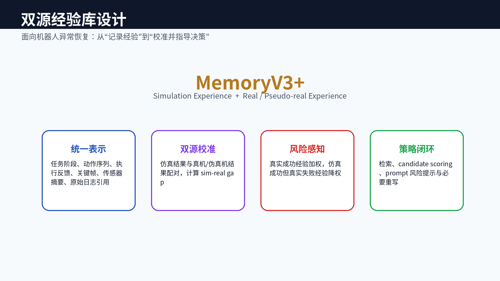
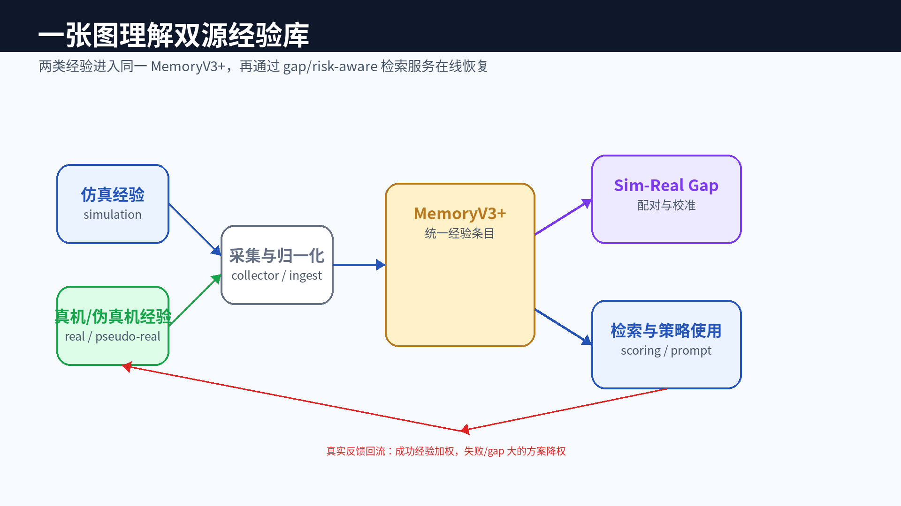
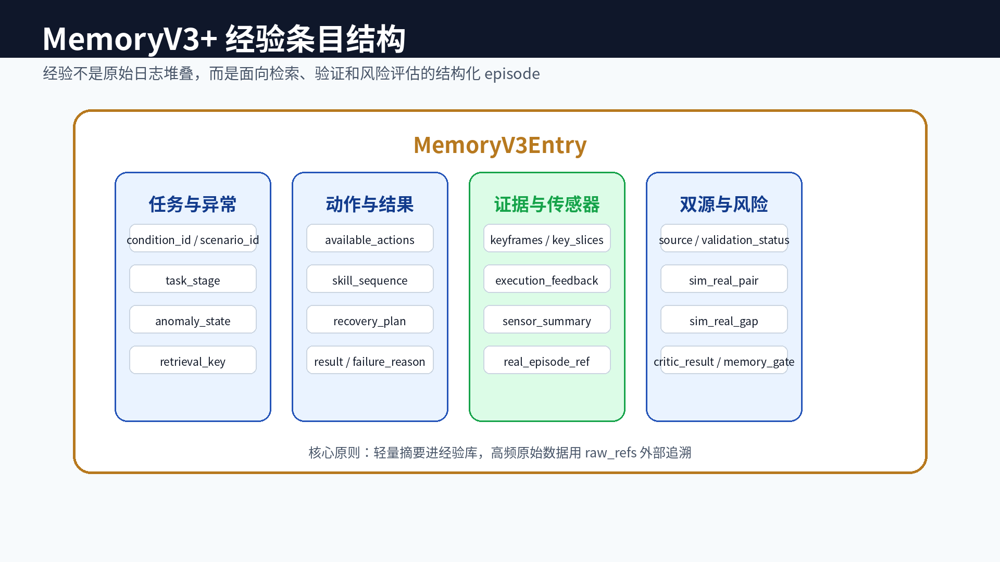
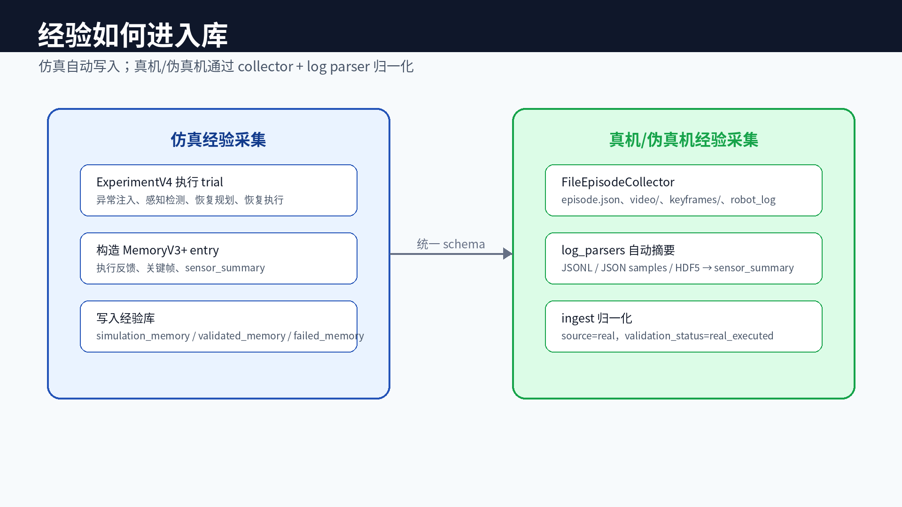
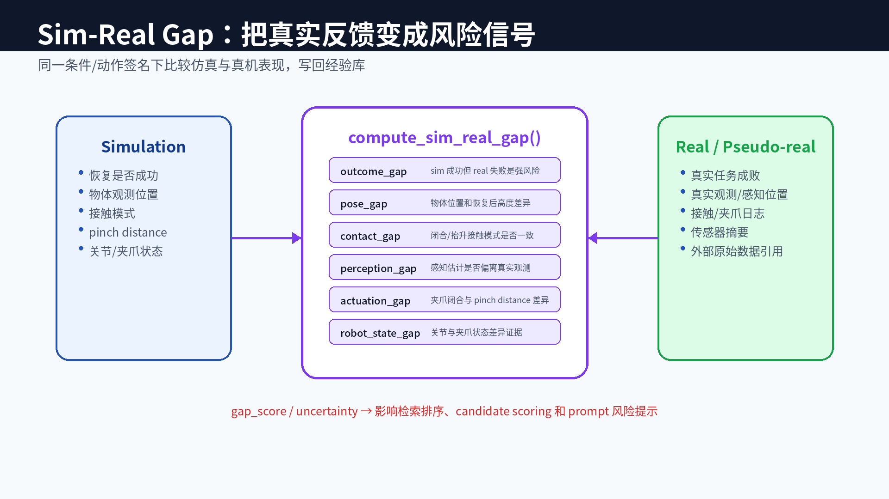
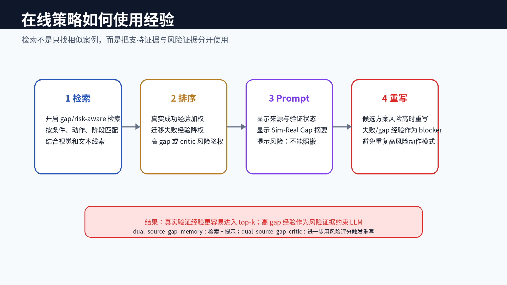
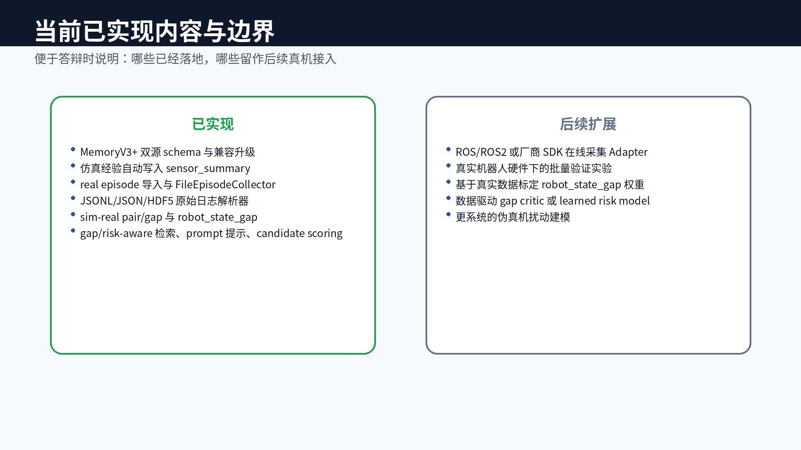

# 双源经验库设计

{width=100%}

# 一张图理解双源经验库

{width=100%}

# MemoryV3+ 经验条目结构

{width=100%}

# 经验如何进入库

{width=100%}

# Sim-Real Gap：真实反馈校准

{width=100%}

# 在线策略如何使用经验

{width=100%}

# 当前已实现内容与边界

{width=100%}
